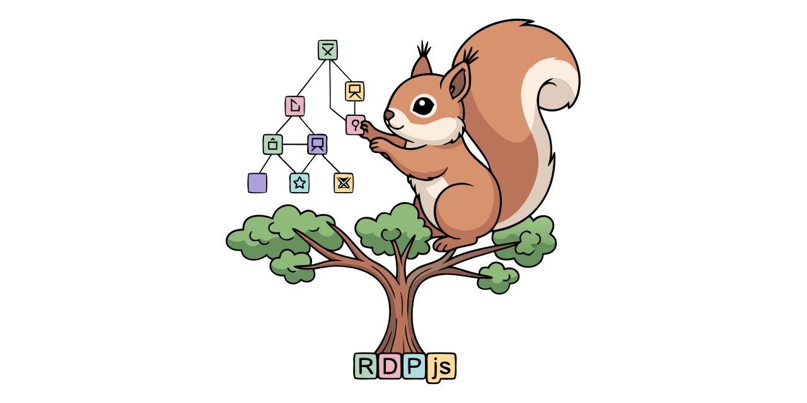

# RDP.js

Write parsers, not boilerplate. Drop in a grammar, get a fully typed TypeScript parser — zero dependencies, dual ESM/CJS, batteries included.

<div align="center">



<sub>Hi, I'm recursquirrel, your friendly recursively descending parsing squirrel</sub>

</div>

## Stability

> [!WARNING]
> **This library is pre-1.0.** Minor versions may introduce breaking changes to the public API, CLI flags, and generated output. Pin to an exact version in production.

## What is `@configuredthings/rdp.js`?

A minimal, typed base class that handles buffer management and position tracking so subclasses can focus purely on grammar rules. TypeScript, dual ESM/CJS, zero runtime dependencies.

Key components:
- **`RDParser`** — base class; subclass and implement each production rule as a method
- **`rdp-gen`** — CLI; reads an ISO 14977 EBNF or RFC 5234 ABNF grammar file and emits a strictly-typed TypeScript parser class and exported discriminated-union parse-tree types
  - **`rdp-gen --scaffold`** — generates for a given grammar a one-time typed starter file for a named usage pattern (`interpreter`, `facade`, `pipeline`, `tree-walker`, `transformer`, `json-transformer`); composable via `--inner`
  - **`rdp-gen init`** — scaffolds a complete new project with `package.json`, `tsconfig.json`, and a starter parser class
- **`GrammarInterpreter`** — runtime interpreter; execute grammars without a code-generation step
- **`ObservableRDParser`** — opt-in parse tracing via an attached `ParseObserver`

## LL(1) grammars and backtracking

> [!IMPORTANT]
> **`rdp-gen` generates parsers that assume LL(1) grammars.** Feeding it a non-LL(1) grammar will produce a parser that silently returns incorrect results, not a helpful error — with one exception: left recursion is detected at generation time and rejected.

**What LL(1) means:** the parser scans left-to-right (first L), produces the leftmost derivation (second L), and needs only one byte of lookahead (the 1) to decide which production to apply at each step. Grammars where two alternatives share a common prefix, or where a rule is ambiguous, are not LL(1).

**The base class is more general.** `RDParser` exposes `restorePosition`, which allows hand-written subclasses to implement backtracking and parse grammars beyond LL(1). `rdp-gen` does not emit backtracking code — that is a hand-crafting concern.

Left recursion can always be eliminated by rewriting the grammar to use iteration (`{...}` / `A, {A}`), which is what LL(1) grammars require.

## Quick start — scaffold a new project

```bash
npm install -g @configuredthings/rdp.js
mkdir my-parser && cd my-parser
rdp-gen init --name my-parser
npm install
npm run build   # compiles src/MyParser.ts → dist/
```

`rdp-gen init` writes a `package.json`, `tsconfig.json`, and a starter
`src/MyParser.ts` with the private-constructor / static-`parse` boilerplate
pre-filled. Add `--observable` to extend `ObservableRDParser` instead.

## Quick start — generate a parser from a grammar

```bash
# Generate a strictly-typed parser class from an EBNF grammar
rdp-gen date.ebnf --parser-name DateParser --output src/DateParser.ts

# Generate a usage scaffold for the pattern that fits your use case
rdp-gen date.ebnf --parser-name DateParser --scaffold facade --inner interpreter --output src/date.ts
```

`rdp-gen --scaffold <pattern>` emits a one-time typed starter file — imports,
entry points, stubs, and error handling in place — ready to fill in. Standalone
patterns: `interpreter`, `tree-walker`, `transformer`. Two-way transformer: `json-transformer` (scaffolds
both `ParseTree → JSONAST` and `JSONAST → string` stubs in one file). Composable wrappers: `facade --inner <strategy>`,
`pipeline --inner <strategy>`. See the
[CLI reference](https://configuredthings.github.io/RDP.js/docs/cli/) for details.

## Manual setup

Install: `npm install @configuredthings/rdp.js`

Required `tsconfig.json` options:
```json
{
  "compilerOptions": {
    "target": "ES2022",
    "strict": true,
    "noUncheckedIndexedAccess": true,
    "moduleResolution": "node16"
  }
}
```

- `target: ES2022` — required for native `#` private fields
- `strict: true` — the generated parser and its parse-tree types are verified to compile cleanly under this setting
- `noUncheckedIndexedAccess: true` — all array accesses in the generated code are null-aware
- `moduleResolution: node16` or `bundler` — required for the package exports map

## Documentation

Full documentation is at [configuredthings.github.io/RDP.js](https://configuredthings.github.io/RDP.js), including:

- [Tutorial: arithmetic parser with rdp-gen](https://configuredthings.github.io/RDP.js/docs/tutorial/)
- [Worked example: arithmetic parser — grammar, generated parser, and all four scaffolds](https://configuredthings.github.io/RDP.js/docs/arith-example/)
- [Extending RDParser (hand-crafted parsers)](https://configuredthings.github.io/RDP.js/docs/extending/)
- [Debugging with ObservableRDParser](https://configuredthings.github.io/RDP.js/docs/debugging/)
- [CLI reference](https://configuredthings.github.io/RDP.js/docs/cli/)
- [Bootstrapping](https://configuredthings.github.io/RDP.js/docs/bootstrapping/)
- [API reference (TypeDoc)](https://configuredthings.github.io/RDP.js/api/)

## Live playground

[configuredthings.github.io/RDP.js](https://configuredthings.github.io/RDP.js)
